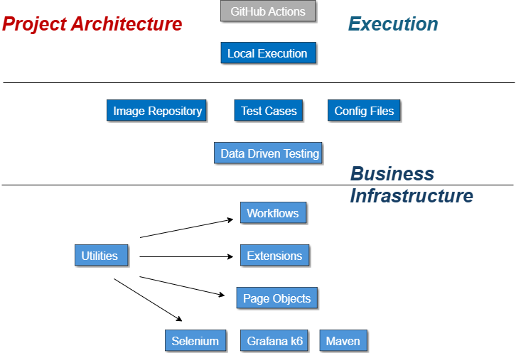

# MyFinancialPlan Selenium project

## About

MyFinancePlan is a SaaS website for creating and tracking personal financial plans. It allows users to build and manage their own plans by tracking income and expenses, view other users’ plans (if sharing access is enabled), access median financial data based on their status for comparison, and receive actionable steps alerts to help implement and monitor plans according to their path to the goals and dreams.

## Project Overview

 

| Features                      | Description                    |
|-------------------------------------|--------------------------|
| Login page                          | Includes the following: 1. Link to create an account 2. Email address 3. Password  4. Login button 5. Quick connect button 6. Forgot password link |
| Registration page                   | Includes the following: 1. Login link 2. Email address 3. Password 4. Password verification 5. Account creation button 6. Quick registration button |
| OTP verification                    | Include email Verification |
| Profile page                        | Includes the following: 1. Email Address 2. Submit Request Button 3. Return to Login Page Link                       |
| Layout                              | Includes the following: 1. Financial plan 2. Monthly goal 3.My financial plan 4. Summary of actions 5. Home page 6. Other people's plans 7. Profile page |
| The financial planning process      | Includes the following: 1. Expenses and incomes 2. Financial goals 3. Multi-year recurring expenses 4. Emergency fund                           |
| Purchase offer page                 | Includes the following: 1. Basic service path 2. Standard service path 3. Prime service path                          |
| Clearing page                       | Includes the following: 1. Choosing a provider 2. Payment details 3. Purchase button redirects to the home page                                 |
| View/Edit Financial Plan Page       | Includes the following: 1. expenses and incomes 2. Financial goals 3. Emergency  Fund                                  |
| Profile page                        | Includes the following: 1. First name 2. Last name 3. Email 4. Cell phone 5. Age 6. Marital status 7. Number of children                 |

## Sanity test

| Test cases                           | Description              |
|--------------------------------------|--------------------------|
| New User register to the website     | Register to the website with username and password. |
| Login to Homepage                    | Login to the website with username and password. |
| Create a profile                  | Create profile with the following details: 1. firstName 2. lastName 3. age 4. Marital status 5. Gender 6. Single breadwinner 7. Residential area, etc. |
| Introduction page                    | Verify expanding of 3 goals in the page. |
| Add several incomes                  | Add incomes with amonut like: 1. First job 2. Second job 3. Allowance |
| Add several expenses                 | Add expenses with amount like: 1. Apartment 2. Internet and media 3. Car |
| Congratulation page                  | Choose financial path Prime service |
| Order summary page                   | Fill in the following details and redirect to  the Payment page: 1. Full name 2. Email address                          |
| Credit checkout page                 | Fill in the payment information  |
| Join success page                    | Enable "I want to watch other people's financial plans." checkbox and redirect to the Home page                                   |
| Home page                            | Navigate to the following links: 1. Home page 2. Profile 3. Path to goals and dreams 4. My plan 5. Other people’s plans 6. Report a problem 7. Suggestions for improvement 8. Contact us |
| Notification icon                    | Click on the notifications icon and verify that each update you made appears in the notifications list.                    |
| Actions (Deposit and withdrawal)     | — |

## Validation test

| Test cases                           | Description              |
|--------------------------------------|--------------------------|
| Reset password page                  | — |
| Registration page                    | — |

